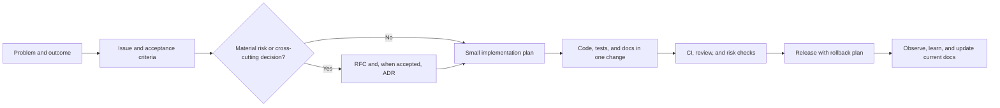

# Project Starter

An opinionated, private-by-default GitHub template for starting software projects and implementing features with disciplined human and AI-assisted engineering.

The repository provides the operating system around the code: product framing, architecture and decision records, feature workflow, security and operations guidance, AI instructions, GitHub collaboration templates, and executable checks that keep the foundation intact. It deliberately does not choose a programming language, framework, database, cloud, or license for the next project.

## Start a project

1. Select **Use this template** on GitHub and create a private repository.
2. Clone the new repository.
3. Complete [PROJECT_SETUP.md](PROJECT_SETUP.md) before implementing the first feature.
4. Run the starter checks:

   ```shell
   python scripts/verify.py
   python -m unittest discover -s tests -v
   ```

5. Open a feature issue with acceptance criteria, then work through a short-lived pull request.

## Operating model



Documentation is proportional to consequence. A small local fix needs a clear issue, tests, and an accurate pull request. A durable architectural, security, data, API, dependency, or operational decision also needs an RFC or ADR. We preserve decisions and evidence—not every chat message, command, or intermediate thought.

## What is included

| Need | Starting point |
| --- | --- |
| Product purpose and measurable outcomes | [Product brief](docs/product/brief.md) |
| Project and feature delivery | [Project lifecycle](docs/project-lifecycle.md) and [feature lifecycle](docs/feature-lifecycle.md) |
| Current system shape | [Architecture overview](docs/architecture/overview.md) |
| Durable decisions | [Architecture decision records](docs/architecture/decisions/README.md) |
| Larger proposed changes | [Design documents](docs/design/README.md) |
| Testing strategy | [Testing guide](docs/testing.md) |
| Threats and secure development | [Threat model](docs/security/threat-model.md) and [security practices](docs/security/secure-development.md) |
| Deployment and recovery | [Operations runbook](docs/operations/runbook.md), [SLOs](docs/operations/slo.md), and [backup/restore](docs/operations/backup-restore.md) |
| AI-assisted work | [AGENTS.md](AGENTS.md) and [AI development guide](docs/ai-development.md) |
| GitHub controls | [GitHub governance](docs/github-governance.md) |
| Documentation ownership | [Documentation policy](docs/documentation-policy.md) |

The complete documentation map is in [docs/README.md](docs/README.md).

## Defaults

- Start as a modular monolith with explicit boundaries. Split services only after evidence justifies the operational cost.
- Keep `main` releasable, use short-lived branches, and merge reviewed pull requests after required checks pass.
- Keep repositories private until a deliberate release review covers licensing, secrets, privacy, security, packaging, and user documentation.
- Treat deterministic CI, human review, and AI review as complementary controls. None replaces the others.
- Test observable behavior at the cheapest reliable level, then add integration, platform, and live checks where risk requires them.
- Keep current-state documentation accurate in the same pull request that changes behavior. Record significant decisions separately in ADRs.

## Definition of done

A change is done only when its acceptance criteria are met; relevant tests pass; security, data, migration, observability, and rollback impacts are handled; affected documentation is current; and the pull request states what was and was not validated.

This starter validates its own structure only. After choosing a stack, extend CI with the real formatter, linter, type checker, tests, build, dependency audit, and—where applicable—installed or deployed behavior checks. A green skeleton check is not evidence that application behavior works.

## License

No license is included because the correct choice depends on ownership and distribution. Select one explicitly during project setup; without a license, normal copyright restrictions apply.
