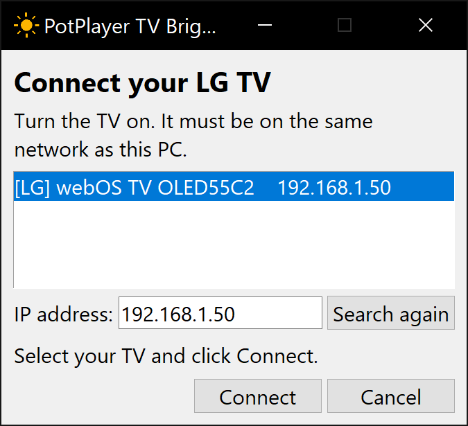
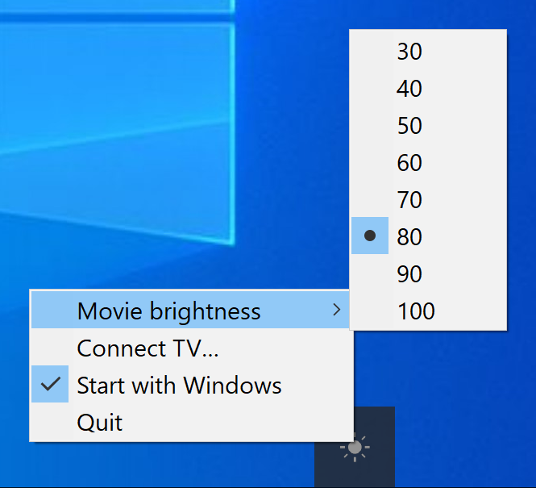

# PotPlayer TV Brightness

A Windows tray app for an LG webOS TV used as a PC monitor. While PotPlayer is playing, it sets the TV's **OLED Pixel Brightness** to your movie value. When you pause, minimize, or close PotPlayer, it puts the original value back.

Tested on an LG C2 (webOS 25) with PotPlayer 64-bit. Other LG webOS TVs may work but are untested.

## Download

Get **PotPlayer-TV-Brightness.exe** from the [latest release](https://github.com/roko-tech/potplayer-tv-brightness/releases/latest). There is nothing to install.

Windows may show "Windows protected your PC", because the app is not signed. Click **More info**, then **Run anyway**. Releases are immutable and list SHA-256 checksums; the [user guide](docs/user/README.md#install) shows how to check a download.

## First run

1. Turn on the TV. It must be on the same home network as the PC.
2. Start the exe. The **Connect your LG TV** window finds your TV. Click **Connect**.
3. On the TV, select **Accept** with the remote.



A sun icon appears in the tray (it may be under the **^** arrow). No Developer Mode, rooting, or LG account is needed.

## Use

Right-click the sun icon:

- **Movie brightness**: the value used while PotPlayer plays (30 to 100).
- **Connect TV…**: connect again, for example after the TV's address changed.
- **Start with Windows**: start the app when you sign in.
- **Quit**: puts the original brightness back and exits.



The icon turns amber while the movie brightness is on. Hover it to see the status. More in the [user guide](docs/user/README.md).

## Run from source

Needs Python 3.12 and [uv](https://docs.astral.sh/uv/).

```shell
git clone https://github.com/roko-tech/potplayer-tv-brightness.git
cd potplayer-tv-brightness
uv sync
.venv\Scripts\pythonw.exe run.pyw
```

The same Connect window appears on first start. From source, the app keeps its files in the repository folder.

## Build the exe

Needs [Visual Studio Build Tools](https://visualstudio.microsoft.com/visual-cpp-build-tools/) with the "Desktop development with C++" workload, because PyInstaller's launcher is compiled from source (the stock one draws more antivirus false alarms).

```shell
packaging\build.cmd
```

It writes the release files to `dist\`: `PotPlayer-TV-Brightness.exe`, `THIRD-PARTY-NOTICES.txt`, and `SHA256SUMS.txt`. The steps to publish a release are in the [runbook](docs/operations/runbook.md#release-the-exe).

## Development

```shell
uv sync --locked
uv run ruff format --check .
uv run ruff check .
uv run mypy
uv run python scripts/verify.py
uv run python -m unittest discover -s tests -v
uv run python -m scripts.tv_check        # live: read the TV's picture mode and brightness
```

## Docs

- [Product brief](docs/product/brief.md)
- [Architecture](docs/architecture/overview.md) and [decisions](docs/architecture/decisions/README.md)
- [Testing](docs/testing.md), [threat model](docs/security/threat-model.md), [runbook](docs/operations/runbook.md)
- [Documentation map](docs/README.md)

## License

[MIT](LICENSE).

The TV pairing manifest, `potplayer_tv_brightness/pairing.json`, is LG's signed remote-app manifest as published in [lgtv2](https://github.com/hobbyquaker/lgtv2) (MIT, Copyright (c) Sebastian Raff). The exe also bundles Python and other libraries, including pystray (LGPL-3.0); their licenses are in each release's `THIRD-PARTY-NOTICES.txt`.

Not affiliated with LG Electronics or the makers of PotPlayer.
