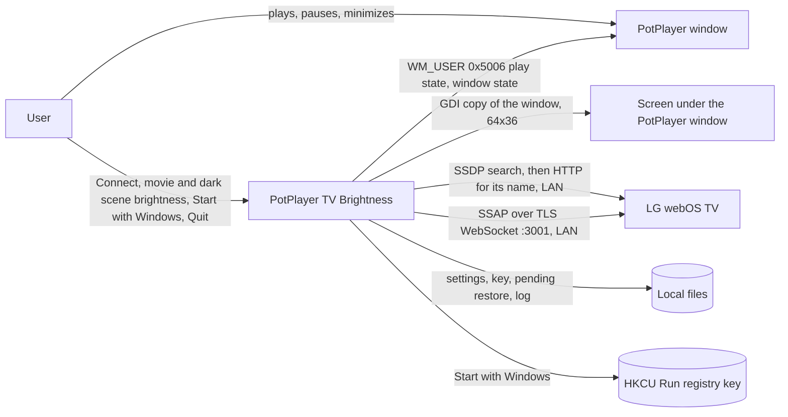

# Architecture overview

- Status: Current (v0.2.0)
- Owner: @rokogan
- Last reviewed: 2026-10-02

One Python process on the Windows PC: a tray icon plus a polling thread, shipped as a single-file exe or run from source. No server, database, or cloud service.

## System context

## Runtime

- **Main thread:** on first run (no TV address yet), the Tk Connect window; then the pystray tray icon and menu. pystray runs menu actions on this thread, so none of them may wait on the network, except Quit's bounded wait (15 s) for the restore.
- **Poll thread:** every 0.5 s asks PotPlayer for its state, then calls `Controller.tick`. While PotPlayer plays and the dark scene value is above the movie value, it also measures how bright the picture is (about 33 ms, 9 ms of it CPU) and passes that to `tick`. All brightness changes happen here, so a slow TV never blocks the menu.
- **Connect window workers:** the Connect window searches (SSDP, about 3 s) and pairs (up to 60 s for Accept) on short-lived threads that hand results back through a queue. **Connect TV…** opens the window on its own thread and then swaps the controller's TV.
- A named mutex (`Local\potplayer-tv-brightness`) allows a single instance; a second start exits quietly.
- **Quit** stops the poll thread, which restores the TV before the process exits.

`scripts/tv_check.py` is the developer's command-line check and connect tool; it uses the same `LGTV` adapter and the source-mode files.

## Module map

| Module | Responsibility | Owns data | May depend on | Public contract |
| --- | --- | --- | --- | --- |
| `controller.py` | Boost/restore rules: settle time, HDR skip, per-mode originals, retries, dark scenes | `restore.json` via `RestoreStore` | Standard library only | `Controller.tick(watching, now, level)`, `shutdown()`; `TV`/`TVSession` protocols, `Picture`, `TVError` |
| `tv.py` | LG SSAP client: pairing, read picture mode and brightness, set brightness | `tv-client-key.txt` | `controller` types, `websocket-client` | `LGTV(host, key_file).session()` |
| `discovery.py` | Find LG TVs with SSDP from every IPv4 address; read each TV's name | None | Standard library only | `find_tvs()`, `FoundTV` |
| `connect.py` | The Tk Connect window: list found TVs, pair, explain failures | None (the caller saves the address) | `discovery`, `tv`, `controller` types, Tk, `Pillow` | `connect_dialog(host, key_file, icon)`, `explain()` |
| `potplayer.py` | Which PotPlayer window, if any, is playing and not minimized or hidden | None | Win32 `user32` via `ctypes` | `watching_window()` |
| `scene.py` | How bright the brighter part of a window's picture is on screen (the luma 90% of it stays under), reduced to one number | None | Win32 `user32` and `gdi32` via `ctypes`, `Pillow` | `picture_level(hwnd)` |
| `app.py` | Settings, file locations, logging, tray, poll thread, single instance, Start with Windows | `settings.json`, log file, the `Run` value | All of the above, `pystray`, `Pillow` | `main()` (started by `run.pyw`) |

Dependency direction: `app` → `connect` → `discovery`/`tv` → `controller`. The controller defines the TV port it needs, and `tv.py` implements it. `potplayer.py`, `scene.py`, and `discovery.py` are leaves; the controller only sees the number `scene.py` measures.

## Packaging

`packaging\build.cmd` compiles PyInstaller's launcher from source (fewer antivirus false alarms than the stock one), then PyInstaller builds `dist\PotPlayer-TV-Brightness.exe` from `packaging/potplayer-tv-brightness.spec`: one file, no console, `pairing.json` bundled, the icon drawn from the tray icon, and Windows version info read from `pyproject.toml`. The same build writes `THIRD-PARTY-NOTICES.txt` from the bundled packages' license files and `SHA256SUMS.txt`. PyInstaller is in the `build` dependency group only; releases follow the [runbook](../operations/runbook.md#release-the-exe). See [ADR-0004](decisions/0004-ship-a-single-file-exe-with-a-connect-window.md).

## Data

The exe keeps its files in `%APPDATA%\PotPlayer TV Brightness`; from source they live in the repository folder.

| File | Content | Classification |
| --- | --- | --- |
| `settings.json` | TV IP address (none until connected), movie brightness, dark scene brightness (0 is Off) | Local config |
| `tv-client-key.txt` | TV pairing key | Secret (controls the TV) |
| `restore.json` | `{picture mode: original brightness}` while a restore is owed | Local state |
| `potplayer-tv-brightness.log` | Status changes and errors | Local, no secrets |

Git ignores all of them. **Start with Windows** adds one value, named after the app, to `HKCU\Software\Microsoft\Windows\CurrentVersion\Run`. Nothing else is stored or sent anywhere. Picture measurements for dark scenes stay in memory as one number each; the log records only the number at each switch.

## Reliability

- TV calls use a fresh connection per operation with a 3 s timeout (60 s while an Accept prompt is on screen). A TV that is off or rebooting needs no reconnect logic. A malformed address is reported like an unreachable TV.
- A PotPlayer state must hold for 1 s before the app acts (no flicker between playlist items).
- A dark scene must hold for 2 s before the dark scene value applies, and a normal one for 1 s before the movie value returns. Black frames, levels between the two cut-offs, and missing measurements change nothing and call off a pending switch ([ADR-0005](decisions/0005-raise-brightness-in-dark-scenes-from-a-screen-measurement.md)).
- A failed or deferred TV change is retried every 10 s.
- The original brightness is saved to disk before the movie value is written, so a crash can never lose it.
- Unexpected errors in the poll thread are logged and polling continues. An unexpected error in the Connect window is shown in the window instead of freezing it.

Decisions: [ADR-0002](decisions/0002-control-tv-brightness-over-webos-ssap.md) (TV control and stack), [ADR-0003](decisions/0003-restore-per-picture-mode-with-a-persisted-debt.md) (restore rules), [ADR-0004](decisions/0004-ship-a-single-file-exe-with-a-connect-window.md) (exe and Connect window), and [ADR-0005](decisions/0005-raise-brightness-in-dark-scenes-from-a-screen-measurement.md) (dark scenes).
