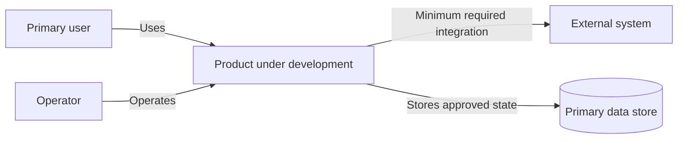
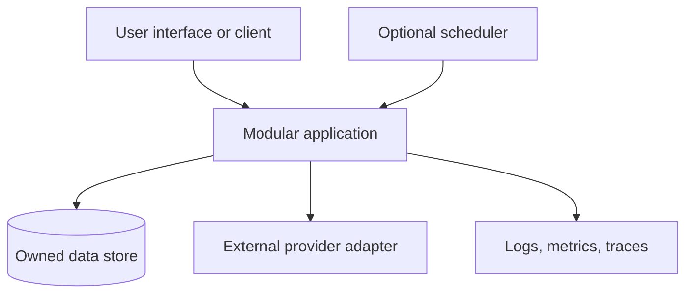

# Architecture overview

- Status: Starter baseline; replace project-specific placeholders before the first production feature.
- Owner: Technical owner
- Last reviewed: 2026-08-20

## Default architecture

Start with a modular monolith: one deployable application with explicit internal modules, plus only the external infrastructure the first user journey actually requires. This reduces distributed-system coordination while preserving boundaries that can be extracted later if measured scale, isolation, deployment cadence, or ownership demands it.

Suggested dependency direction:

```text
Interfaces (HTTP, CLI, UI, jobs)
        -> Application use cases
        -> Domain rules
        -> Ports owned by the application/domain

Infrastructure adapters (database, queues, vendors)
        -> Implement those ports
```

Domain and application logic must not depend on a web framework, database client, or vendor SDK unless the project records a deliberate exception. Modules own their invariants and data access; cross-module interaction uses explicit APIs or events rather than reaching into another module's tables or internals.

## System context

Replace this generic C4-style view with real people, systems, trust boundaries, and data classes.



## Containers and runtime



For each real container, document its responsibility, owner, technology, deployment unit, inputs/outputs, data classification, scaling limit, and failure behavior.

## Module map

| Module | Responsibility | Owns data | May depend on | Public contract |
| --- | --- | --- | --- | --- |
| Define during setup | One cohesive business capability | Define | Define | Define |

Rules:

- Keep business invariants with the module that owns them.
- Validate untrusted data at the boundary and convert it to explicit internal types.
- Make transactions and consistency expectations visible.
- Hide vendor-specific behavior behind narrow adapters when switching, testing, or failure isolation has real value.
- Prefer synchronous calls inside the process. Introduce queues/events only for a defined durability, latency, load, or decoupling requirement.

## Data and contracts

Document schemas, ownership, classification, retention, deletion, migrations, idempotency, compatibility, and backup requirements. Public APIs and durable event formats are versioned contracts. Database migrations must be forward-safe and have a rollback or roll-forward strategy.

## Reliability and observability

Define timeouts, retries with bounds/jitter, idempotency, backpressure, graceful degradation, and dependency failure behavior at real boundaries. Instrument user journeys and service-level indicators, not only host health. Logs must be structured, actionable, and free of unapproved sensitive data.

## When to split a service

Require evidence for at least one durable need: independent scaling, fault/security isolation, separate data sovereignty, materially different deployment cadence, or stable independent ownership. Record the tradeoff in an ADR, including network failure, observability, deployment, testing, and consistency costs.

Architecture decisions are indexed in [decisions/README.md](decisions/README.md). Proposed cross-cutting designs live in [../design/README.md](../design/README.md).
