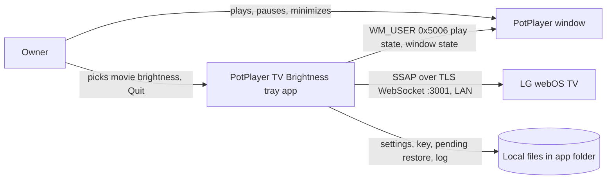

# Architecture overview

- Status: Current (v0.1.0)
- Owner: @rokogan
- Last reviewed: 2026-09-25

One Python process on the Windows PC: a tray icon plus a polling thread. No server, database, or cloud service.

## System context

## Runtime

- **Main thread:** the pystray tray icon and menu.
- **Poll thread:** every 0.5 s asks PotPlayer for its state, then calls `Controller.tick`. All TV network calls happen here, so a slow TV never blocks the menu.
- A named mutex (`Local\potplayer-tv-brightness`) allows a single instance.
- **Quit** stops the poll thread, which restores the TV before the process exits.

## Module map

| Module | Responsibility | Owns data | May depend on | Public contract |
| --- | --- | --- | --- | --- |
| `controller.py` | Boost/restore rules: settle time, HDR skip, per-mode originals, retries | `restore.json` via `RestoreStore` | Standard library only | `Controller.tick(watching, now)`, `shutdown()`; `TV`/`TVSession` protocols, `Picture`, `TVError` |
| `tv.py` | LG SSAP client: pairing, read picture mode and brightness, set brightness | `tv-client-key.txt` | `controller` types, `websocket-client` | `LGTV(host, key_file).session()` |
| `potplayer.py` | Is any PotPlayer window playing and not minimized or hidden | None | Win32 `user32` via `ctypes` | `is_watching()` |
| `app.py` | Settings, logging, tray, poll thread, single instance | `settings.json`, log file | All of the above, `pystray`, `Pillow` | `main()` (started by `run.pyw`) |

Dependency direction: `app` → `controller` ← `tv`. The controller defines the TV port it needs, and `tv.py` implements it. `potplayer.py` is a leaf.

## Data

| File | Content | Classification |
| --- | --- | --- |
| `settings.json` | TV IP address, movie brightness | Local config |
| `tv-client-key.txt` | TV pairing key | Secret (controls the TV) |
| `restore.json` | `{picture mode: original brightness}` while a restore is owed | Local state |
| `potplayer-tv-brightness.log` | Status changes and errors | Local, no secrets |

All are ignored by Git. Nothing else is stored or sent anywhere.

## Reliability

- TV calls use a fresh connection per operation with a 3 s timeout (60 s while an Accept prompt is on screen). A TV that is off or rebooting needs no reconnect logic.
- A PotPlayer state must hold for 1 s before the app acts (no flicker between playlist items).
- A failed or deferred TV change is retried every 10 s.
- The original brightness is saved to disk before the movie value is written, so a crash can never lose it.
- Unexpected errors in the poll thread are logged and polling continues.

Decisions: [ADR-0002](decisions/0002-control-tv-brightness-over-webos-ssap.md) (TV control and stack) and [ADR-0003](decisions/0003-restore-per-picture-mode-with-a-persisted-debt.md) (restore rules).
