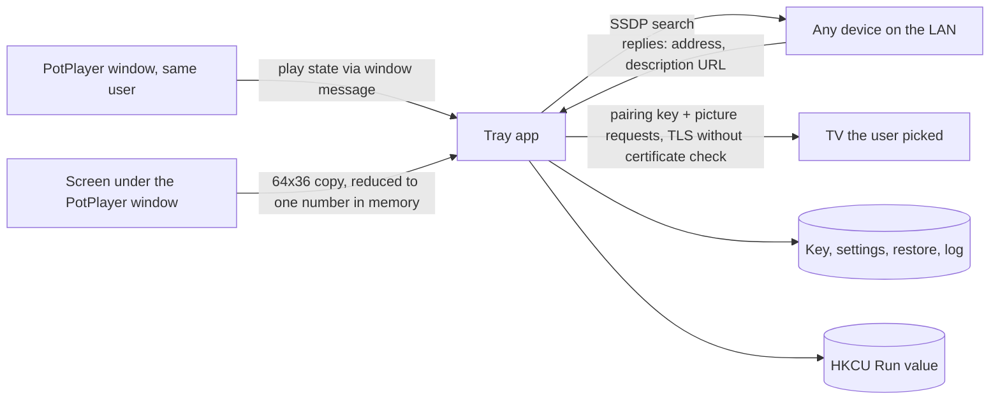

# Threat model

- Status: Current (v0.2.0)
- Owner: @rokogan
- Last reviewed: 2026-10-02 (dark scene screen measurement)

## Scope and security objectives

A Windows tray app that each user runs on their own PC, as a downloaded exe or from source. It reads PotPlayer's state and changes one picture setting on their LG TV over the home network. With dark scene brightness on, it also reads the PotPlayer window's picture from the screen while a video plays. The source is meant to be public, so nothing secret or personal belongs in the repository. The app must:

- keep the TV pairing key out of Git, logs, and error messages;
- keep screen content in memory only, reduced to one number per measurement: never stored, logged, or sent;
- only ever write the `backlight` picture setting, with values from 0 to 100;
- never leave the TV in a worse state than before (the original brightness is always recoverable);
- talk to nothing outside the home network: the TV, plus an SSDP search on the LAN and a name request to the devices that answer it.

## Assets

| Asset | Sensitivity/value | Owner | Storage/transit | Retention/deletion |
| --- | --- | --- | --- | --- |
| TV pairing key (`tv-client-key.txt`) | High: anyone with it on the LAN can control the TV (inputs, apps, settings) | @rokogan | Local file (`%APPDATA%` for the exe), Git-ignored; sent only to the chosen TV over TLS | Delete the file and re-pair. On the TV, only a factory reset is known to revoke it |
| Original brightness (`restore.json`) | Low | @rokogan | Local file, Git-ignored | Deleted once restored |
| Settings and log | Low (TV IP, brightness, status) | @rokogan | Local files, Git-ignored | Log rotates at 256 KB |
| Screen content under the PotPlayer window | Medium: shows what the user watches, or a window on top of it | User | Copied as 64x36 pixels into memory while a video plays with dark scenes on, reduced to one number at once | Discarded right away; the log keeps one number per switch |
| Released exe | High: runs as the user on every PC that downloads it | @rokogan | Built from a reviewed commit on the maintainer's PC; GitHub release | Replaced by the next release |
| Source and CI | Medium | @rokogan | Public GitHub repository (since 2026-09-27): no keys, TV addresses, or personal data; commits use the GitHub noreply identity; secret scanning, push protection, and a protected `main` | Git history |

## Actors and capabilities

- **User:** runs the app on their own PC and TV, picks the TV to connect to, and edits settings.
- **Anyone who downloads the exe:** cannot verify the publisher, because the exe is unsigned; only the SHA-256 on the release page.
- **Public readers and contributors:** read the source and open issues or pull requests. CI runs pull-request code with a read-only token and no secrets.
- **Other devices on the home LAN:** can reach the TV and answer the app's SSDP search; a compromised one could impersonate the TV or sniff traffic.
- **Other local processes:** already run as the same user, so they can read the key file and edit the `Run` value anyway.
- **Dependencies, build tools, and CI:** pinned packages (including PyInstaller, build only) and SHA-pinned GitHub-owned Actions.

## Trust boundaries and data flow

## Threat register

| Scenario | Preconditions/path | Impact | Existing control | Validation | Residual risk/owner |
| --- | --- | --- | --- | --- | --- |
| Key committed or logged | Developer error | TV control by anyone on that home network who obtains it | `.gitignore` entries; the key is never logged or printed | `git status --ignored` before commits; code review (the key is only read, sent in the register message, and written to its file) | Low / @rokogan |
| LAN attacker impersonates the TV | ARP/DNS spoofing on the home LAN; the TV's self-signed certificate cannot be verified | Key captured, then TV control | Home LAN only; TLS still encrypts against passive sniffing | None (accepted) | Accepted: pinning the TV certificate would add complexity for a home network. Revisit if the TV moves to a shared network. / @rokogan |
| Fake TV in the Connect window | A LAN device answers the SSDP search with an LG-looking reply, and the user picks it; with an existing key, **Connect TV…** sends that key to it | Same as a captured key | The list shows each name with its IP address; the user chooses; nothing connects until they click Connect | `test_discovery.py` (only LG second-screen replies are listed) | Accepted, same class as TV impersonation above / @rokogan |
| Hostile SSDP replies | A LAN device sends a description URL for another host, a huge or slow body, or crafted XML | The app contacts other hosts, hangs, or mis-parses | The name is fetched only from the replying address, over plain HTTP without proxies, within a 2 s budget and 64 KB; a regex reads `friendlyName`, no XML parser; on any failure the name is "LG TV" | `test_discovery.py` (other hosts are never fetched) | Low / @rokogan |
| Malicious or malformed TV replies | Spoofed or buggy TV | App error | Replies parsed defensively; only a string mode and an integer brightness are used; errors become `TVError` and are retried | `test_tv.py` malformed and error cases | Low / @rokogan |
| Wrong setting or value written | Bug, bad settings file | Picture changed unexpectedly | Only `backlight` is written; `movie_brightness`, `dark_scene_brightness`, and `tv_check --set` are clamped to 0 to 100; originals are restored per mode | `test_controller.py`, `test_app.py`, `test_tv_check.py` | Low / @rokogan |
| Screen content kept or leaked | A bug or debugging code saves, logs, or sends the screen copy | What the user watches, or a window on top of it, is exposed | `scene.picture_level` returns only a number; the 64x36 copy lives in memory for one call; only the number is logged, at a switch; nothing is measured unless PotPlayer plays, is not minimized, and dark scenes are on | Code review of `scene.py` and its callers; `test_scene.py` | Low / @rokogan |
| Something else on screen drives the brightness | A window on top of PotPlayer, or a video crafted to flip between dark and bright | The TV switches between the movie and dark scene values | Only the user's two values are ever written; no measurement when the center of the window belongs to another window; 2 s and 1 s holds and a gap between the cut-offs limit switching; originals stay saved | `test_controller.py`, `test_scene.py` | Negligible / @rokogan |
| Tampered or fake exe | Someone redistributes a modified exe, or a release file is replaced | Code execution on users' PCs | Immutable releases: after publishing, the tag and files cannot change, and GitHub signs a release attestation (`gh release verify-asset`); `SHA256SUMS.txt` in every release; builds come from a fresh clone of the tagged commit and are scanned with Windows Defender and VirusTotal first | Release steps in the [runbook](../operations/runbook.md#release-the-exe) | Medium, accepted: the exe is unsigned. Free signing through SignPath Foundation needs a public repository and a CI build / @rokogan |
| Fake PotPlayer window | Local process creates a `PotPlayer64` window | Brightness raised | Same-user process could do worse already | None needed | Negligible / @rokogan |
| Key or log pasted into a public issue | User error while reporting a bug | Same as a leaked key | The log never contains the key; the bug form says never to paste `tv-client-key.txt` | Log calls reviewed: status, mode, brightness, and errors only | Low / @rokogan |
| Dependency, build tool, or CI compromise | Malicious package, PyInstaller release, or action | Code execution on the PC, or in every shipped exe | Exact pins with hashes in `uv.lock`, PyInstaller only in the `build` group, Dependabot, GitHub-owned Actions pinned to SHAs, read-only workflow token | Dependabot PRs go through CI | Low / @rokogan |

## Review triggers

Update this model if the app talks to anything outside the home network, writes other TV settings, stores new data, reads more of the screen than the PotPlayer window, or ships through another channel (an installer, automatic updates, or a store).
