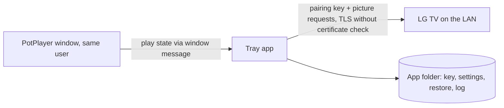

# Threat model

- Status: Current (v0.1.0)
- Owner: @rokogan
- Last reviewed: 2026-09-25

## Scope and security objectives

A single-user Windows tray app that reads PotPlayer's state and changes one picture setting on an LG TV over the home network. It must:

- keep the TV pairing key out of Git, logs, and error messages;
- only ever write the `backlight` picture setting, with values from 0 to 100;
- never leave the TV in a worse state than before (the original brightness is always recoverable);
- talk to nothing except the configured TV.

## Assets

| Asset | Sensitivity/value | Owner | Storage/transit | Retention/deletion |
| --- | --- | --- | --- | --- |
| TV pairing key (`tv-client-key.txt`) | High: anyone with it on the LAN can control the TV (inputs, apps, settings) | @rokogan | Local file, Git-ignored; sent only to the TV over TLS | Delete the file and re-pair; revoke by factory reset or the TV's device list |
| Original brightness (`restore.json`) | Low | @rokogan | Local file, Git-ignored | Deleted once restored |
| Settings and log | Low (TV IP, brightness, status) | @rokogan | Local files, Git-ignored | Log rotates at 256 KB |
| Source and CI | Medium | @rokogan | Private GitHub repository | Git history |

## Actors and capabilities

- **Owner:** runs the app and edits settings.
- **Other devices on the home LAN:** can reach the TV; a compromised one could impersonate it or sniff traffic.
- **Other local processes:** already run as the owner, so they can read the key file anyway.
- **Dependencies and CI:** pinned packages and SHA-pinned GitHub-owned Actions.

## Trust boundaries and data flow

## Threat register

| Scenario | Preconditions/path | Impact | Existing control | Validation | Residual risk/owner |
| --- | --- | --- | --- | --- | --- |
| Key committed or logged | Developer error | TV control by others with repo access | `.gitignore` entries; the key is never logged or printed | `git status --ignored` before commits; code review (the key is only read, sent in the register message, and written to its file) | Low / @rokogan |
| LAN attacker impersonates the TV | ARP/DNS spoofing on the home LAN; the TV's self-signed certificate cannot be verified | Key captured, then TV control | Home LAN only; TLS still encrypts against passive sniffing | None (accepted) | Accepted: pinning the TV certificate would add complexity for a home network. Revisit if the TV moves to a shared network. / @rokogan |
| Malicious or malformed TV replies | Spoofed or buggy TV | App error | Replies parsed defensively; only a string mode and an integer brightness are used; errors become `TVError` and are retried | `test_tv.py` malformed and error cases | Low / @rokogan |
| Wrong setting or value written | Bug, bad settings file | Picture changed unexpectedly | Only `backlight` is written; `movie_brightness` is clamped to 0 to 100; originals are restored per mode | `test_controller.py`, `test_app.py` | Low / @rokogan |
| Fake PotPlayer window | Local process creates a `PotPlayer64` window | Brightness raised | Same-user process could do worse already | None needed | Negligible / @rokogan |
| Dependency or CI compromise | Malicious package or action | Code execution on the PC | Exact pins with `uv.lock`, Dependabot, GitHub-owned Actions pinned to SHAs, read-only workflow token | Dependabot PRs go through CI | Low / @rokogan |

## Review triggers

Update this model if the app talks to anything besides the TV, writes other TV settings, stores new data, or is shared beyond the owner.
