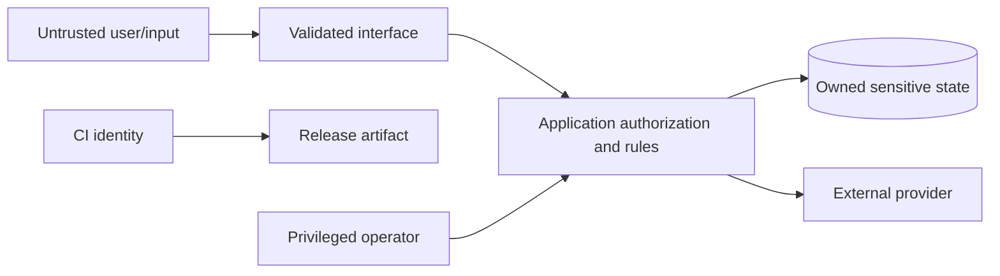

# Threat model

- Status: Starter baseline; complete during project setup and review after every trust-boundary change.
- Owner: Security owner or technical owner
- Last reviewed: 2026-08-20

## Scope and security objectives

Define the system, environments, data, users, operators, dependencies, and workflows covered. State the properties that must hold, such as:

- users can access only resources they are authorized to access;
- secrets and sensitive data are never committed, exposed to clients, or written to unsafe logs;
- untrusted input cannot trigger unintended code, queries, network access, file access, or external side effects;
- important writes are authenticated, authorized, validated, auditable, and recoverable;
- dependency or CI compromise cannot silently publish an unreviewed artifact.

## Assets

| Asset | Sensitivity/value | Owner | Storage/transit | Retention/deletion |
| --- | --- | --- | --- | --- |
| User data | Define | Define | Define | Define |
| Credentials/tokens | Critical | Define | Secret manager only | Rotate/revoke |
| Source/build/release | High | Define | GitHub and artifact store | Define |
| Service availability/integrity | High | Define | Runtime | Define |

## Actors and capabilities

List anonymous users, authenticated roles, administrators, operators, external providers, CI identities, insiders, compromised dependencies, and attackers. For each, define intended permissions and plausible misuse.

## Trust boundaries and data flow

Replace this starter view with real boundaries and label protocols, authentication, and data classes.

## Threat register

| Scenario | Preconditions/path | Impact | Existing control | Validation | Residual risk/owner |
| --- | --- | --- | --- | --- | --- |
| Identity spoofing/session theft | Define | Unauthorized access | Define | Auth tests | Define |
| Cross-user/tenant access | Missing object-level authorization | Data disclosure/change | Deny by default | Negative authorization tests | Define |
| Injection or unsafe parsing | Untrusted input reaches interpreter/query/path | Code/data compromise | Typed parameters and allowlists | Adversarial tests | Define |
| Server-side request/file access | User controls URL/path | Internal/data access | Scheme/host/path policy | Boundary tests | Define |
| Secret or private-data leakage | Logs, errors, prompts, artifacts | Confidentiality breach | Redaction/minimization | Log/artifact review | Define |
| Dependency/CI compromise | Mutable action or excessive token | Source/release compromise | SHA pins and least privilege | Workflow audit | Define |
| Replay/duplicate side effect | Retry or duplicate delivery | Double charge/write/message | Idempotency keys | Duplicate/restart tests | Define |
| Resource exhaustion/abuse | Costly unauthenticated operation | Availability/cost | Limits, quotas, backpressure | Load/abuse tests | Define |
| Destructive admin error | Excess privilege or unsafe operation | Data loss/outage | Approval, dry run, backup | Restore/recovery drill | Define |

## Review triggers

Update this model when adding identities/roles, sensitive data, external integrations, file/network processing, AI tools, public endpoints, background jobs, payment or messaging side effects, deployment identities, or a new trust boundary. Link security tests and accepted risk to the implementing pull request or ADR.
