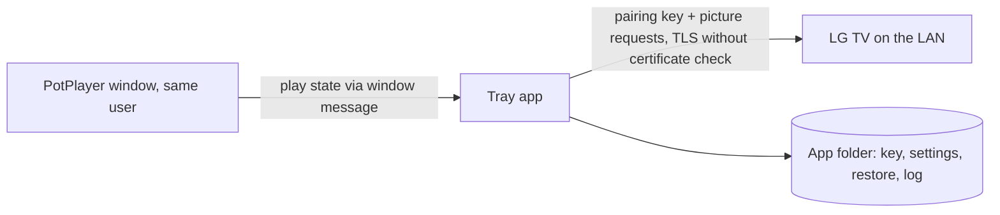

# Threat model

- Status: Current (v0.1.0)
- Owner: @rokogan
- Last reviewed: 2026-09-26 (prepared for public release)

## Scope and security objectives

A Windows tray app that each user runs on their own PC. It reads PotPlayer's state and changes one picture setting on their LG TV over the home network. The source is meant to be public, so nothing secret or personal belongs in the repository. The app must:

- keep the TV pairing key out of Git, logs, and error messages;
- only ever write the `backlight` picture setting, with values from 0 to 100;
- never leave the TV in a worse state than before (the original brightness is always recoverable);
- talk to nothing except the configured TV.

## Assets

| Asset | Sensitivity/value | Owner | Storage/transit | Retention/deletion |
| --- | --- | --- | --- | --- |
| TV pairing key (`tv-client-key.txt`) | High: anyone with it on the LAN can control the TV (inputs, apps, settings) | @rokogan | Local file, Git-ignored; sent only to the TV over TLS | Delete the file and re-pair. On the TV, only a factory reset is known to revoke it |
| Original brightness (`restore.json`) | Low | @rokogan | Local file, Git-ignored | Deleted once restored |
| Settings and log | Low (TV IP, brightness, status) | @rokogan | Local files, Git-ignored | Log rotates at 256 KB |
| Source and CI | Medium | @rokogan | GitHub repository, written to be public: no keys, TV addresses, or personal data; commits use the GitHub noreply identity | Git history |

## Actors and capabilities

- **User:** runs the app on their own PC and TV, and edits settings.
- **Public readers and contributors:** read the source and open issues or pull requests. CI runs pull-request code with a read-only token and no secrets.
- **Other devices on the home LAN:** can reach the TV; a compromised one could impersonate it or sniff traffic.
- **Other local processes:** already run as the same user, so they can read the key file anyway.
- **Dependencies and CI:** pinned packages and SHA-pinned GitHub-owned Actions.

## Trust boundaries and data flow

## Threat register

| Scenario | Preconditions/path | Impact | Existing control | Validation | Residual risk/owner |
| --- | --- | --- | --- | --- | --- |
| Key committed or logged | Developer error | TV control by anyone on that home network who obtains it | `.gitignore` entries; the key is never logged or printed | `git status --ignored` before commits; code review (the key is only read, sent in the register message, and written to its file) | Low / @rokogan |
| LAN attacker impersonates the TV | ARP/DNS spoofing on the home LAN; the TV's self-signed certificate cannot be verified | Key captured, then TV control | Home LAN only; TLS still encrypts against passive sniffing | None (accepted) | Accepted: pinning the TV certificate would add complexity for a home network. Revisit if the TV moves to a shared network. / @rokogan |
| Malicious or malformed TV replies | Spoofed or buggy TV | App error | Replies parsed defensively; only a string mode and an integer brightness are used; errors become `TVError` and are retried | `test_tv.py` malformed and error cases | Low / @rokogan |
| Wrong setting or value written | Bug, bad settings file | Picture changed unexpectedly | Only `backlight` is written; `movie_brightness` and `tv_check --set` are clamped to 0 to 100; originals are restored per mode | `test_controller.py`, `test_app.py`, `test_tv_check.py` | Low / @rokogan |
| Fake PotPlayer window | Local process creates a `PotPlayer64` window | Brightness raised | Same-user process could do worse already | None needed | Negligible / @rokogan |
| Key or log pasted into a public issue | User error while reporting a bug | Same as a leaked key | The log never contains the key; the bug form says never to paste `tv-client-key.txt` | Log calls reviewed: status, mode, brightness, and errors only | Low / @rokogan |
| Dependency or CI compromise | Malicious package or action | Code execution on the PC | Exact pins with `uv.lock`, Dependabot, GitHub-owned Actions pinned to SHAs, read-only workflow token | Dependabot PRs go through CI | Low / @rokogan |

## Review triggers

Update this model if the app talks to anything besides the TV, writes other TV settings, stores new data, or gains a distribution channel beyond this source repository (a packaged executable or installer).
